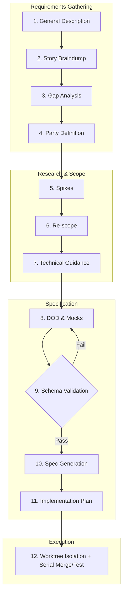
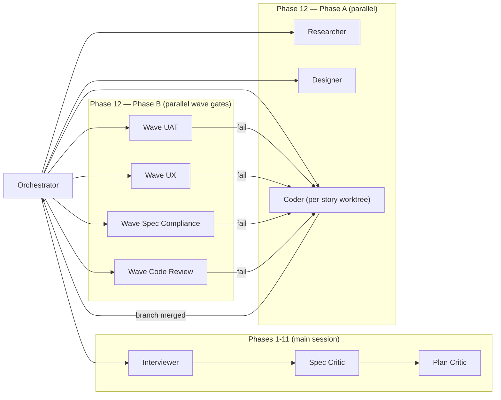
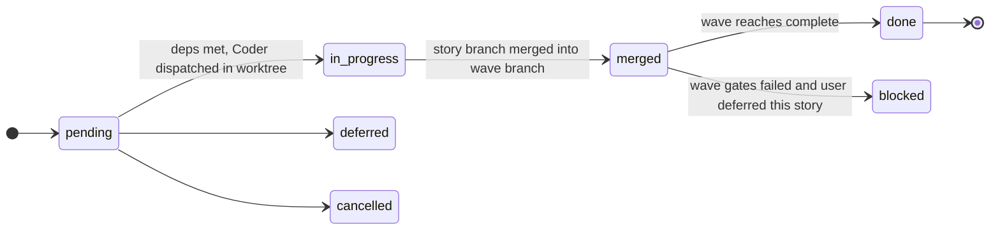
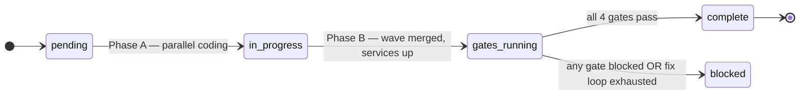

<div align="center">
  <picture>
    <source media="(prefers-color-scheme: dark)" srcset="assets/banner-dark.svg">
    <source media="(prefers-color-scheme: light)" srcset="assets/banner-light.svg">
    
  </picture>

  <br/><br/>

  [](https://github.com/djpate/kryptonite)
  [](https://github.com/djpate/kryptonite/releases)
  [](LICENSE)
  [](#agent-architecture)
  [](#how-it-works--12-phase-workflow)

</div>

<br/>

## What Happens When You Use Kryptonite

You tell Claude Code what you want to build — in plain language, no special format. Kryptonite takes over and interviews you: one question at a time, it pulls out everything it needs to understand the project. What the system does, who uses it, what can go wrong, what you're unsure about.

When it hits something uncertain — "which payment provider?", "can we handle the load?", "how does that API actually work?" — it doesn't guess. It creates **spikes**: focused research tasks that run immediately. Researcher agents investigate, produce findings, and bring answers back before any planning begins. You decide what to keep, what to cut, and what changes based on what was learned.

Once your stories are solid, it writes a **Definition of Done** for every single one — not vague acceptance criteria, but concrete automated checks. "POST /tickets returns 201" verified by curl. "The ticket appears in the customer's list" verified by Chrome. Every DOD item must be provably testable.

It generates a branded HTML spec you can review and comment on inline in your browser. A **Spec Critic** agent reviews it for gaps before you even see it. Same for the implementation plan — a **Plan Critic** checks for conflicts and ordering issues first. You review, leave comments, iterate until it's right.

Then execution: stories are grouped into **waves** (parallel batches ordered by dependency). Within each wave, Coder agents work in parallel on isolated git worktrees — no database conflicts, no migration stomping. As each finishes, the orchestrator merges and tests serially: QA runs every DOD check, Reviewer verifies quality. If anything fails, it loops back — no story is marked done without passing every gate. After each wave, the QA agent drives through real user flows in the browser to verify integration.

Close your laptop, come back days later, say "let's build" — Kryptonite reads where you left off and continues from that exact phase. Nothing is lost between sessions.

---

## Quick Start

### Install

```bash
claude plugin install kryptonite --url https://github.com/djpate/kryptonite
```

### Trigger

Say any of these to Claude Code:

<kbd>let's build...</kbd>&nbsp;&nbsp;<kbd>I want to build...</kbd>&nbsp;&nbsp;<kbd>spec this out</kbd>&nbsp;&nbsp;<kbd>new project</kbd>&nbsp;&nbsp;<kbd>plan this</kbd>

Or just describe what you want to build — Kryptonite activates automatically.

---

## Usage

### The Interview

Kryptonite asks you to describe the big picture, then invites you to dump all your user stories in whatever format you like — bullet points, paragraphs, half-formed thoughts. It accumulates silently, then probes gaps one at a time: missing error cases, incomplete flows, ambiguous scope, actors that need stories but don't have them. It identifies the **parties** (actors) in your system — Admin, User, System — and confirms boundaries and permissions with you.

You don't need to know agile methodology. Just talk about what you want built and who needs to do what.

### Spikes (Research Before Planning)

This is where Kryptonite diverges from typical AI coding tools. When there's an open question that would affect how you build — which library to use, whether a third-party API supports what you need, how a regulation works, whether an approach is feasible at scale — Kryptonite creates a **spike**.

Spikes are research tasks that execute immediately via Researcher agents. They produce decision documents with recommendations. After spikes return, you enter a **re-scope** phase: the findings might add stories, remove them, change the approach, or confirm the original plan. You decide — Kryptonite won't silently expand your project based on research findings.

This happens BEFORE DODs are written, before the spec exists, before any planning. It prevents the classic problem of building a detailed plan around assumptions that turn out to be wrong.

### Multi-Repo Projects

Most real projects span multiple repos — an API, a frontend, maybe an admin panel or a shared library. Kryptonite handles this natively.

Register your repos once using the **repos** skill:

<kbd>add a repo</kbd>&nbsp;&nbsp;<kbd>list repos</kbd>&nbsp;&nbsp;<kbd>update repo</kbd>&nbsp;&nbsp;<kbd>remove repo</kbd>

When you point Kryptonite at a repo path, it auto-detects the stack, run command, and test command from the repo's files (`package.json`, `Gemfile`, `go.mod`, `Cargo.toml`, `Makefile`, etc.) and asks you to confirm.

Each repo entry stores:
- **Path** and **stack** — so agents know where to work and what tools are available
- **Run command** — so QA can start the service for testing
- **Test command** — so the test suite can be executed
- **Testing notes** — free-form field for credentials, URLs, seed commands, API keys, anything agents need

Stories get assigned to a specific repo. If a story touches multiple repos (e.g., an API endpoint AND the frontend that consumes it), Kryptonite **auto-splits** it into linked sub-stories — `US-005a` (API) depends on nothing, `US-005b` (frontend) depends on `US-005a`. Each gets its own DOD validated against its own repo.

The registry persists across epics at `.kryptonite/repos.json` — define your repos once, use them in every project.

### The Spec & Plan

Once stories, spikes, and DODs are complete, Kryptonite generates `spec.json` and `plan.json` validated against schemas (`spec-schema.json`, `plan-schema.json`, both composing the existing `story-schema.json` via `$ref`). The schemas enforce structure: every architectural component has an ID and a repo, every API endpoint has a method and auth model, every wave has a `user_journeys[]` array of executable browser steps. The LLM can't ship vague prose — the validator rejects it.

A web UI at `http://localhost:3847` reads the JSON via `/api/spec` and `/api/plan` and renders a dark-themed sidebar layout. You can click any section to leave inline comments. The live dashboard at `/dashboard` shows wave progress and gate status; a mock gallery at `/mocks` shows approved visual mockups.

Before you see the spec, a **Spec Critic** agent reviews it for: missing dependencies, weak DODs, contradictions, cross-repo contract mismatches. The implementation plan groups stories into waves — parallel batches where no story conflicts with another in the same wave, and all dependencies are in earlier waves. A **Plan Critic** reviews for file conflicts, missing infrastructure, unrealistic breakdowns, and ordering issues.

You approve (or comment and iterate on) both the spec and plan before execution begins.

### Execution

Phase 12 splits each wave into two phases.

**Phase A — Parallel coding.** Stories in a wave are dispatched to Coder agents in parallel, each in its own git worktree on an isolated branch (`wave-N/US-XXX`). Coders write code and commit. As each finishes, its branch merges into the wave branch (`wave-N`) with a merge commit. NO validation runs between merges — fast and cheap. After all stories merge, the wave branch merges into the main worktree's branch.

**Phase B — Wave gates.** With the full wave integrated and the application running, four gate agents validate in parallel:

- **UAT** — walks `user_journeys[]` from plan.json via Chrome MCP. Real navigation, real assertions, real screenshots.
- **UX** — screenshots the implementation and compares to the approved mocks side-by-side. Categorizes drift (colors, layout, typography, spacing, missing element, responsive).
- **Spec Compliance** — verifies each story's `acceptance_criteria` items, including ones the user journeys don't exercise.
- **Code Review** — full diff review covering security, correctness, error handling, dead code, performance, and egregious style.

Each gate writes a structured JSON report validated against `wave-gate-report-schema.json`. Gates have three outcomes: **pass**, **fail**, or **blocked**. Blocked means infrastructure (Chrome MCP, service start) isn't reachable — the orchestrator pauses and asks you for help instead of pretending the gate passed via static analysis. False passes are worse than blocked statuses.

When a gate fails on real code defects, an **adaptive fix loop** runs. Each issue gets up to three fix attempts: same Coder + more context → Researcher + new Coder → pause for user. Only failed gates re-run after a fix; passed gates carry forward. The wave advances only when all four gates report `pass`; story statuses transition from `merged` to `done` in bulk.

Service lifecycle is driven by `repos.json[].testing` (`start_command`, `stop_command`, `health_check`, `app_url`, `ready_signal`) — kryptonite is infrastructure-agnostic. Marengo, docker-compose, foreman, plain `npm start` — anything you can express as a shell command.

### Resuming & Restarting

**Resume:** Start a new Claude Code session and trigger Kryptonite. It detects your active epic from plugin storage, reads `current_phase` from `epic.json`, and picks up exactly where you left off.

**New epic:** Say <kbd>new epic</kbd> or <kbd>start a new project</kbd>. The current epic is archived and a fresh one begins. Your repo registry persists.

**Amendments:** During execution, story requirements can change. The state machine tracks amendment history, marks affected stories for re-validation, and adjusts wave ordering if new dependencies emerge — no full restart needed.

---

## Key Concepts

| Term | Meaning |
|:-----|:--------|
| **Epic** | A self-contained project or feature set. One active at a time, archived when complete. |
| **Party** | An actor in the system — Admin, User, System, External Service. Kryptonite identifies these from your stories. |
| **Spike** | A research task that executes before planning. Answers unknowns so you don't plan around assumptions. |
| **DOD** | Definition of Done — concrete, automatable proof. Not "it works" but specific commands with expected outputs. |
| **Wave** | A batch of stories that can execute in parallel. Ordered by dependency — no wave runs until the previous one passes. |
| **State Machine** | The enforcement layer. Stories: pending → in_progress → merged → done. Waves: pending → in_progress → gates_running → complete (or blocked). Steps cannot be skipped. |
| **Wave Gate** | Wave-level validation that runs after a wave's stories all merge. Four gates in parallel: UAT, UX, Spec Compliance, Code Review. Wave only advances when all four pass. |
| **Blocked Gate** | Gate status reserved for infrastructure problems (Chrome MCP unreachable, service won't start). Orchestrator pauses for the user instead of running the fix loop, since dispatching Coders can't fix infrastructure. |
| **User Journey** | Concrete browser walkthrough defined per wave in plan.json. Steps[] array of Chrome MCP actions (navigate, click, fill, assert_text, screenshot...). The UAT gate executes these. |

---

## Why Kryptonite?

| Concern | Typical AI Coding | Kryptonite |
|:--------|:-----------------|:-----------|
| Requirements | "Just build it" | 12-phase structured interview, one question at a time |
| Unknowns | Hope for the best | Spikes execute research immediately, findings shape the plan |
| Validation | Trust the AI | Every DOD item proven by curl, Chrome MCP, or test suite |
| Quality gates | None | UAT + UX + Spec Compliance + Code Review run in parallel at wave end; a `blocked` status forces a pause instead of faking pass |
| Parallel agents | DB conflicts, migration stomping | Worktree isolation per story for coding; single merge into wave branch; gates run once per wave (not per story) |
| Multi-repo | One file at a time | Cross-repo auto-split with dependency tracking and per-repo QA |
| State | Lost between sessions | Persistent state with exact-phase resume |
| Scope creep | Uncontrolled growth | Re-scope phase after spikes — user decides what stays |

---

<details>
<summary><strong>How It Works — 12-Phase Workflow</strong></summary>
<br/>



</details>

<details>
<summary><strong>Agent Architecture</strong></summary>
<br/>



| Agent | Role |
|:------|:-----|
| **Orchestrator** | Main-session driver of Phase 12; enforces state machine and the four-gate wave loop |
| **Interviewer** | Main-session conversation partner for Phases 1–11 — one question at a time |
| **Designer** | Visual mockups with progressive direction locking (Phase 8) |
| **Researcher** | Spike execution (Phase 5); also dispatched on fix-loop attempt 2 to investigate root cause |
| **Coder** | Implements one story in a worktree (no test execution); fixes on main during the wave fix loop |
| **Wave UAT** | Walks `user_journeys[]` via Chrome MCP after wave merge — reports `pass` / `fail` / `blocked` |
| **Wave UX** | Side-by-side compare of implementation vs approved mocks |
| **Wave Spec Compliance** | Verifies every story's `acceptance_criteria` against the merged wave |
| **Wave Code Review** | Full diff review: security, correctness, error handling, dead code |
| **Spec Critic** | Reviews spec.json for gaps, contradictions, weak DODs (after Phase 10) |
| **Plan Critic** | Reviews plan.json for file conflicts, ordering, infrastructure gaps (after Phase 11) |

</details>

<details>
<summary><strong>State Machine & Execution Loop</strong></summary>
<br/>

Stories and waves move together. A story reaches `merged` when its branch lands in the wave branch; it only flips to `done` retroactively, in bulk with its waves' siblings, when the wave's four gates all pass.





**Invariants enforced on every state write:**

1. A story only reaches `done` when its wave's status is `complete`.
2. A wave only reaches `complete` when all four gate reports in the latest gate run have `status: "pass"`.
3. A wave with any gate `status: "blocked"` pauses for the user — no fix loop, no advance. Blocked is infrastructure (Chrome MCP, service start), not a code defect.
4. A story cannot enter `in_progress` until all its dependencies have `merged` or `done` status.

</details>

<details>
<summary><strong>Project Structure</strong></summary>
<br/>

```
~/.claude/plugins/kryptonite/data/
├── registry.json            # Global project registry
├── active.json              # Maps projects to active epics
└── {project-id}/
    ├── project.json         # Project metadata (source, path)
    ├── repos.json           # Shared repo registry (persists across epics)
    └── {epic-slug}/
        ├── epic.json        # Parties, tech context, current phase
        ├── state.json       # Stories, waves, execution state
        ├── state.json.bak   # Backup (corruption recovery)
        ├── spec.json        # Validated spec (rendered by the SPA at /spec)
        ├── plan.json        # Validated plan with user_journeys (rendered at /plan)
        ├── spec-versions.json  # Versioned spec history
        ├── comments.json    # Persisted review comments
        ├── spikes/          # Research findings
        ├── mocks/           # Visual mockups + screenshots
        └── wave-N/
            └── gates/       # Per-attempt UAT/UX/spec/code-review reports
```

> [!NOTE]
> Epic data lives in the plugin folder — never in your project repo. No `.kryptonite/` clutter, no git noise.

</details>

<details>
<summary><strong>Comment Server & Live Dashboard</strong></summary>
<br/>

During spec review, a local server runs at `http://localhost:3847`:

| Route | Purpose |
|:------|:--------|
| `/` | Commentable spec with inline annotations |
| `/plan` | Commentable implementation plan |
| `/dashboard` | Live progress — waves, DOD checklists, agent attribution |
| `/mocks` | Mock gallery with approved/pending status |
| `/compare` | Fullscreen side-by-side mock comparison (click to pick) |

> [!NOTE]
> The comment server is ephemeral — it runs during review and shuts down when execution completes.

</details>

---

## Requirements

> [!IMPORTANT]
> - **Claude Code** with subagent support
> - **Node.js 18+** (for the comment server)
> - **Chrome DevTools MCP** (for `chrome_mcp` DOD validation and UAT)

---

<div align="center">

**MIT License** · Built by [@djpate](https://github.com/djpate)

*Structured development. Automated validation. No hand-waving.*

</div>
