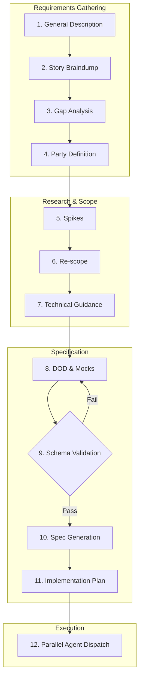
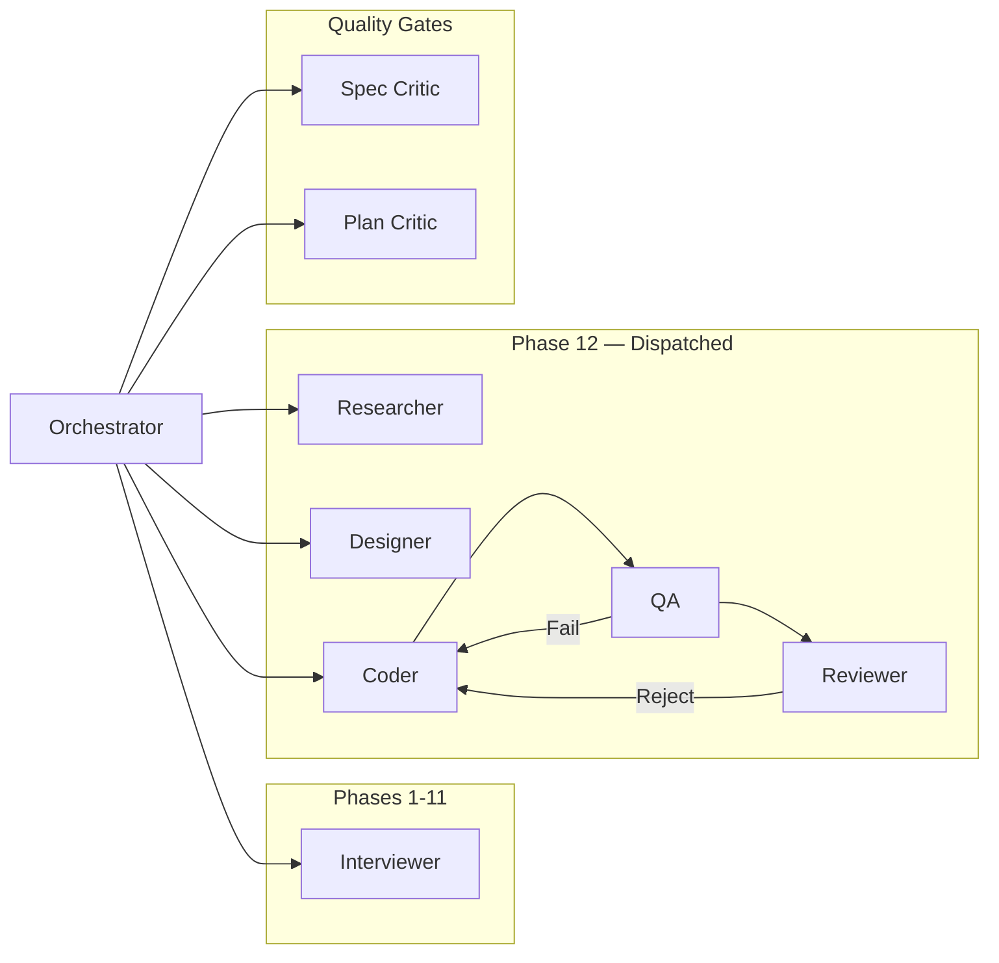
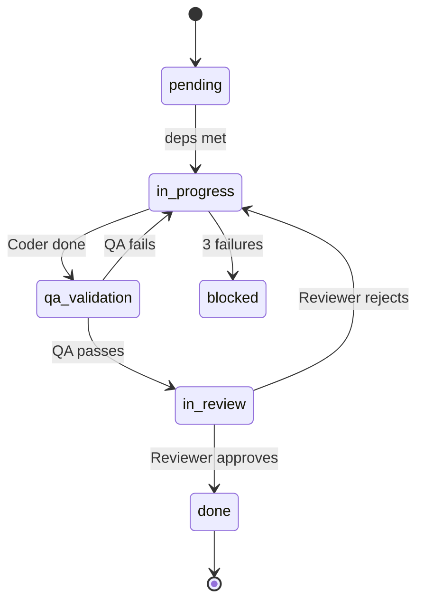

<div align="center">
  <picture>
    <source media="(prefers-color-scheme: dark)" srcset="assets/banner-dark.svg">
    <source media="(prefers-color-scheme: light)" srcset="assets/banner-light.svg">
    
  </picture>

  <br/><br/>

  [](https://github.com/djpate/kryptonite)
  [](https://github.com/djpate/kryptonite/releases)
  [](LICENSE)
  [](#agent-architecture)
  [](#how-it-works)

</div>

<br/>

You describe what you want to build. Kryptonite interviews you, identifies gaps, runs research spikes, generates a branded spec with inline commenting, plans parallel execution waves, then dispatches specialized agents to implement — with automated DOD validation that won't let anything pass without proof.

> **Think:** Project management on steroids for AI-assisted development.

---

## Key Features

| | Feature | What It Means |
|:---:|:---|:---|
| 🔄 | **12-Phase Workflow** | Structured path from "I want to build X" to deployed code |
| 🤖 | **9 Specialized Agents** | Each agent has a single job and does it well |
| ✅ | **Automated DOD Validation** | Every story proven done via curl, Chrome MCP, or test suite |
| 🔒 | **State Machine Enforcement** | Stories cannot skip QA or review — invariants enforced on every write |
| 📦 | **Multi-Repo Support** | Epics span multiple repos with cross-repo auto-splitting |
| 🔬 | **Spike-First Research** | Questions answered before DODs are written — no scope explosions |
| 🎨 | **Visual Mocks + Compare** | Side-by-side mock comparison with click-to-pick |
| 💬 | **Branded Comment Server** | Inline commenting on spec/plan at localhost:3847 |
| 🔁 | **Persistent State** | Resume any epic across sessions — picks up exactly where you left off |
| ⚡ | **Parallel Execution** | Independent stories run simultaneously within waves |

---

## How It Works



---

## Agent Architecture



| Agent | Role |
|:------|:-----|
| **Orchestrator** | Coordinates everything, enforces the state machine |
| **Interviewer** | Guides Phases 1-11 — one question at a time |
| **Designer** | Visual mockups with progressive direction locking |
| **Researcher** | Spike execution, produces decision documents |
| **Coder** | TDD implementation, repo-aware, commits per story |
| **QA** | Automated DOD validation + per-wave UAT |
| **Reviewer** | Spec compliance + code quality review |
| **Spec Critic** | Reviews spec for gaps, contradictions, weak DODs |
| **Plan Critic** | Reviews plan for conflicts, ordering, infra gaps |

---

## Quick Start

### Install

```bash
claude plugin install kryptonite --url https://github.com/djpate/kryptonite
```

### Trigger

Say any of these to Claude Code:

<kbd>let's build...</kbd>&nbsp;&nbsp;<kbd>I want to build...</kbd>&nbsp;&nbsp;<kbd>spec this out</kbd>&nbsp;&nbsp;<kbd>new project</kbd>&nbsp;&nbsp;<kbd>plan this</kbd>

Or just describe what you want to build — Kryptonite activates automatically.

> [!TIP]
> Manage your repo registry independently with:
> <kbd>add a repo</kbd>&nbsp;&nbsp;<kbd>list repos</kbd>&nbsp;&nbsp;<kbd>manage repos</kbd>

---

## Why Kryptonite?

| Concern | Typical AI Coding | Kryptonite |
|:--------|:-----------------|:-----------|
| Requirements | "Just build it" | 12-phase structured gathering |
| Validation | Trust the AI | Automated DOD proof (curl, tests, Chrome MCP) |
| Quality gates | None | QA + Reviewer must both approve |
| Multi-repo | One file at a time | Cross-repo auto-split with dependency tracking |
| Research | Hope for the best | Spike-first workflow before planning |
| State | Lost between sessions | Persistent state with exact-phase resume |

---

<details>
<summary><strong>State Machine & Execution Loop</strong></summary>
<br/>



**Invariants enforced on every state write:**

1. Cannot reach `done` without `dod_validation.all_passed === true`
2. Cannot reach `done` without `review_status === "approved"`
3. Cannot enter `in_review` without passing QA
4. Cannot enter `in_progress` without all dependencies met

</details>

<details>
<summary><strong>Project Structure</strong></summary>
<br/>

```
.kryptonite/
├── repos.json          # Shared repo registry (persists across epics)
├── active              # Slug of the active epic
└── {epic-slug}/
    ├── epic.json       # Parties, tech context, current phase, design direction
    ├── state.json      # Stories, waves, execution state
    ├── comments.json   # Persisted review comments
    ├── spec.html       # Branded spec document
    ├── plan.html       # Implementation plan
    ├── spikes/         # Research findings
    └── mocks/          # Visual mockups + screenshots
```

</details>

<details>
<summary><strong>Comment Server & Live Dashboard</strong></summary>
<br/>

During spec review, a local server runs at `http://localhost:3847`:

| Route | Purpose |
|:------|:--------|
| `/` | Commentable spec with inline annotations |
| `/plan` | Commentable implementation plan |
| `/dashboard` | Live progress — waves, DOD checklists, agent attribution |
| `/mocks` | Mock gallery with approved/pending status |
| `/compare` | Fullscreen side-by-side mock comparison (click to pick) |

> [!NOTE]
> The comment server is ephemeral — it runs during review and shuts down when execution completes.

</details>

---

## Requirements

> [!IMPORTANT]
> - **Claude Code** with subagent support
> - **Node.js 18+** (for the comment server)
> - **Chrome DevTools MCP** (for `chrome_mcp` DOD validation and UAT)

---

<div align="center">

**MIT License** · Built by [@djpate](https://github.com/djpate)

*Structured development. Automated validation. No hand-waving.*

</div>
